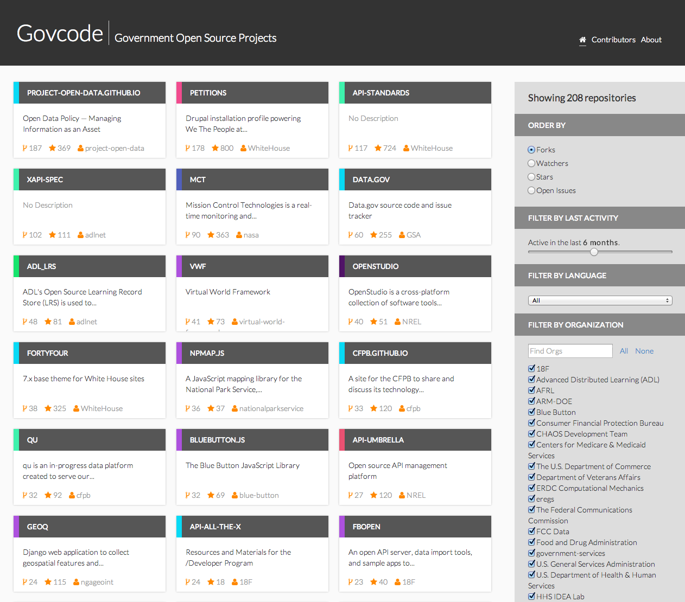

Govcode
=============

[](https://app.wercker.com/project/bykey/a02fb4fa99d40f8de4e90722491b7c2a)

## What is this?

Govcode is an application that lists government open source projects on GitHub.
The purpose is to track what is being worked on and build analytics on top of it.

The Govcode API server and import service is written in [Go](http://golang.org).
Its database is [PostgreSQL](http://www.postgresql.org/).

The Govcode user interface is written in HTML5 and uses the [AngularJS](https://angularjs.org) JavaScript framework.
It uses bower for dependency management and grunt for building/serving during local development.



## Development dependencies

To contribute to Govcode, you will need the following in your development environment:

 - Go
 - PostgreSQL
 - nodejs and npm
 - grunt-cli and bower (`npm install grunt-cli bower`)
 - Ruby and Gem (for installing compass)
 - Compass ruby gem (`gem install compass`)

## PostgreSQL database setup

```
> psql
you# create database govcode with owner govcode;
```

## GitHub API key

In your [Personal Access Tokens](https://github.com/settings/applications#personal-access-tokens) settings,
Generate a new token.

Keep it secret. Keep it safe.

You'll use this token as the `GHE_KEY` environment variable, described below.

## Recommended developer workflow

If you're contributing to the API, written in Go, it's probably easiest to do the following so that you don't have to rewrite paths:

1. in GitHub, fork govcode.org
1. On your computer, `cd $GOPATH/src/github.com`
1. Clone this upstream: `git clone https://github.com/dlapiduz/govcode.org.git --origin upstream`
1. Add your fork as origin: `git remote add origin git@github.com:YOUR_USER/govcode.org.git`

## How to run Govcode

This application is structured as an API and a front end. The `common`, `govcode` and `govcoded` directories 
hold the API code while the `front` directory holds the front end.

All the steps mentioned below assume that you cloned the repo into a local folder.


### Importing GitHub data

To setup the API you need to do the following:
1. Build the `govcode` tool: 
```
cd govcode
go build
```
1. Set the environment variables for the Postgres database and GitHub API key:
```
export GH_KEY="xxx"
export PG_CONN_STR="user=govcode password=govcode dbname=govcode sslmode=disable"
```
1. Migrate the database to build all the tables: 
  `govcode migrate`
1. Run an import to populate the DB:
  ```
  govcode import
  govcode stats
  ```

### Run the API server

Now we have a loaded DB with the settings in the environment.

We recommend a hot reload library such as [gin](https://github.com/codegangsta/gin):

To install gin: `go get github.com/codegangsta/gin`

Then:

```
cd govcoded
gin
```


If you prefer not to use a hot reload library, manually run the server:
```
cd govcoded
go run main.go
```

This should start the API on port 3000. You can change the port by setting the `PORT` environment variable,
e.g. `PORT=5000 gin`

### Run the front end

1. Get the npm packages: 
```
cd front
# ensure grunt-cli and bower are installed:
npm install grunt-cli bower
# ensure Govcode's required modules
npm install
```
1. Get the bower packages: 
`bower install`
1. Run the server: 
`grunt serve`
1. Go to `http://localhost:9000` on your browser

If you see an error about `compass` you might need to install the [compass ruby gem](http://compass-style.org/install/): 
`gem install compass`

## Contributing

All contributions are welcome. You might want to create an issue describing what you want to work on 
to make sure there is no duplication.

## License

This project is licensed under the [MIT license](LICENSE).

